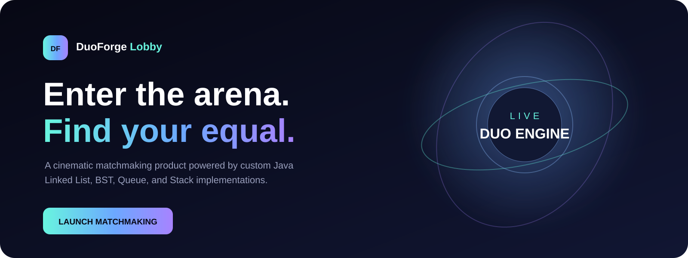

LIVE LINK: https://duo-forge-lobby.vercel.app/

<p align="center">
  
</p>

# DuoForge Lobby

**DuoForge** transforms a Java console-based Data Structures project into a complete, interactive matchmaking product. Players can enter rank-aware online queues, challenge friends, inspect profiles, view a live leaderboard, and explore match history through a cinematic responsive interface.

The backend intentionally uses custom structures instead of replacing the academic logic with database collections:

- **Player Linked List** — complete registration record
- **Player Binary Search Tree** — ID lookup and sorted traversal
- **Three linked Queues** — Rookie, Elite, and Master matchmaking
- **Match Stack** — newest-first match history
- **ArrayList** — player friendship network

## Product features

- Cinematic animated arena with a dependency-free Canvas scene
- Automatic rank-tier matchmaking
- Friend duels and mutual friend linking
- Winner, wins/losses, points, rank and tier progression
- Live Queue telemetry with cancellation
- Leaderboard and BST in-order comparison
- Stack-based match history
- Clickable player intelligence drawer
- Demo data reset for presentations
- JSON REST API
- Single executable Java JAR serving both API and frontend
- Docker, Docker Compose and GitHub Actions
- Project report and viva preparation guide

## Architecture

```text
Browser UI (HTML + CSS + JavaScript)
                │
                │ same-origin HTTP / JSON
                ▼
Java 21 HTTP Server
                │
                ▼
LobbyEngine
 ├── PlayerLinkedList
 ├── PlayerBST
 ├── RookieQueue
 ├── EliteQueue
 ├── MasterQueue
 └── MatchStack
```

No Maven, Gradle, Node.js package installation, external database, or third-party backend library is required.

## Run with Java

Requirements: **JDK 21 or newer**.

### Windows PowerShell

```powershell
.\run.ps1
```

### Linux/macOS

```bash
./scripts/build.sh
java -jar build/duoforge-lobby.jar
```

Open:

```text
http://localhost:8080
```

Health endpoint:

```text
http://localhost:8080/api/health
```

To use another port:

```bash
PORT=9000 java -jar build/duoforge-lobby.jar
```

## Run with Docker

```bash
docker compose up --build
```

Then open `http://localhost:8080`.

## Automated verification

```bash
./scripts/test.sh
```

The test suite verifies:

- registration and BST lookup
- queue waiting and automatic pairing
- friend match creation
- mutual friendship updates
- Stack match history
- BST in-order traversal

## REST API

| Method | Route | Purpose |
|---|---|---|
| `GET` | `/api/health` | Service status |
| `GET` | `/api/state` | Entire dashboard state |
| `GET` | `/api/players/{id}` | Find player through the BST |
| `POST` | `/api/players` | Register or retrieve a player |
| `POST` | `/api/matchmaking/online` | Join a rank queue and auto-match |
| `DELETE` | `/api/matchmaking/queue/{id}` | Cancel queue entry |
| `POST` | `/api/matches/friend` | Start a direct friend duel |
| `POST` | `/api/reset-demo` | Restore presentation data |

Example:

```bash
curl -X POST http://localhost:8080/api/matchmaking/online \
  -H "Content-Type: application/json" \
  -d '{"playerId":777}'
```

## Improvements over the original console version

- A match now has one actual winner; both players no longer receive win points.
- Duplicate queue entries are prevented.
- Players can cancel matchmaking.
- Friend links are mutual and self-challenges are rejected.
- Rank, points, wins, losses, tier and timestamps are visible.
- The engine is synchronized for concurrent HTTP requests.
- IDs and request payloads are validated.
- Original source code is preserved under `original/`.

## Repository map

```text
src/main/java/             Java domain, custom structures, engine and server
src/main/resources/static/ Cinematic browser product
src/test/java/             Dependency-free engine tests
docs/                      Report, viva guide and visual assets
original/                  Original submitted Java file
scripts/                   Build and test scripts
```

## Academic note

This project is designed to demonstrate Data Structures and Algorithms through a product experience. Data is stored in memory and resets when the process restarts. A production commercial platform would normally add authentication, persistent storage, distributed matchmaking and security controls.

## License

MIT
